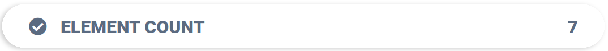

<a name="readme-top"></a>


<!-- PROJECT LOGO -->
<br />
<div align="center">
  <a href="https://github.com/ettore-infn/INFN-Design-Standards/">
    
  </a>

  <h3 align="center">INFN Design Standards</h3>

  <p align="center">
    Standard INFN design guidelines for web development.
    <br />
    <a href="https://github.com/ettore-infn/INFN-Design-Standards/"><strong>Explore the docs »</strong></a>
    <br />
    <br />
    <a href="https://github.com/ettore-infn/INFN-Design-Standards/">View Demo</a>
    ·
    <a href="https://github.com/ettore-infn/INFN-Design-Standards/issues">Report Bug</a>
    ·
    <a href="https://github.com/ettore-infn/INFN-Design-Standards/issues">Request Feature</a>
  </p>
</div>


<!-- TABLE OF CONTENTS -->
<details>
  <summary>Table of Contents</summary>
  <ol>
    <li>
      <a href="#about-the-project">About The Project</a>
    </li>
    <li>
      <a href="#getting-started">Getting Started</a>
    </li>
    <li>
      <a href="#buttons">Buttons</a>
      <ul>
        <li><a href="#regular">Regular</a></li>
        <li><a href="#outline">Outline</a></li>
        <li><a href="#no-border">No Border</a></li>
        <li><a href="#large">Large</a></li>
        <li><a href="#round">Round</a></li>
      </ul>
    </li>
    <li>
      <a href="#text">Text</a>
      <ul>
        <li><a href="#title">Title</a></li>
        <li><a href="#subtitle">Subtitle</a></li>
        <li><a href="#section-title">Section Title</a></li>
        <li><a href="#section-subtitle">Section Subtitle</a></li>
        <li><a href="#plain-text">Plain Text</a></li>
      </ul>
    </li>
    <li>
      <a href="#inputs">Inputs</a>
      <ul>
        <li><a href="#search-bar">Search Bar</a></li>
        <li><a href="#text-input">Text Input</a></li>
        <li><a href="#option-input">Option Input</a></li>
      </ul>
    </li>
    <li>
      <a href="#cards">Cards</a>
      <ul>
        <li><a href="#card">Card</a></li>
        <li><a href="#counter">Counter</a></li>
      </ul>
    </li>
  </ol>
</details>


<!-- ABOUT THE PROJECT -->
## About The Project

Welcome to the world of INFN Design Standards — meticulously crafted to empower developers in creating web applications that effortlessly embody the essence of INFN's unique identity. Dive into this curated collection of classes and stylesheets, ensuring a harmonious blend of aesthetics and functionality across the entire INFN web infrastructure.

<p align="right">(<a href="#readme-top">back to top</a>)</p>


<!-- GETTING STARTED -->
## Getting Started

Include the **INFN Design Standards Stylesheet** in the <code>\<head\></code> of your HTML file:
```html
  <!-- INFN Design Standards Stylesheet -->
  <link rel="stylesheet" type="text/css" href="https://cdn.jsdelivr.net/gh/ettore-infn/INFN-Design-Standards@main/static/style/infn-style.css">
```
 
Now you can start building your website, confident that you're aligning with INFN's design principles with every line of code.

> [!NOTE]
> Consider importing the **fontawesome** library to implement icons.

<p align="right">(<a href="#readme-top">back to top</a>)</p>


<!-- BUTTONS -->
## Buttons

Uncover the elegance of INFN buttons, designed to seamlessly integrate with your user interface. Immerse yourself in three distinct types: **primary**, **danger**, and **warning**. From sophisticated **regular** buttons to subtle **outline** options and **borderless** wonders, **customize sizes from normal to large**.

> [!TIP]
> Enchant your users with **meaningful icons**, providing an intuitive touch to your button interactions.


### Regular

Regular buttons, your trusted companions for **primary actions**, elegantly guide users toward essential goals:


```html
  	<div class="infn-btn infn-btn-primary">Primary</div>
  	<div class="infn-btn infn-btn-danger">Danger</div>
  	<div class="infn-btn infn-btn-warning">Warning</div>
```


### Outline

Embrace outline buttons for **secondary actions**, allowing your design to balance prominence and subtlety:


```html
  <div class="infn-btn infn-btn-primary-outline">Primary</div>
  <div class="infn-btn infn-btn-danger-outline">Danger</div>
  <div class="infn-btn infn-btn-warning-outline">Warning</div>
```


### No Border

Choose outline buttons with no borders for a seamless integration into your interface, **letting your content shine**:


```html
  <div class="infn-btn infn-btn-primary-outline-no-border">Primary</div>
  <div class="infn-btn infn-btn-danger-outline-no-border">Danger</div>
  <div class="infn-btn infn-btn-warning-outline-no-border">Warning</div>
```


### Large

Make a bold statement by **increasing button size** with the class <code>infn-btn-lg</code>:


```html
  <div class="infn-btn infn-btn-primary infn-btn-lg">Primary</div>
  <div class="infn-btn infn-btn-danger-outline infn-btn-lg">Danger</div>
```


### Round

Embrace round buttons for a **space-efficient touch**, perfect for streamlined interactions:


```html
  <div class="infn-btn-round"><i class="fas fa-bookmark"></i></div>
```

<p align="right">(<a href="#readme-top">back to top</a>)</p>


<!-- TEXT -->
## Text

Text, the storyteller of your user interface. Master the art of text usage to enhance readability and create an engaging experience.


### Title

Titles, the first chapter of your narrative. Employ them strategically to **captivate users** from the start:


```html
  <div class="infn-title">Infn Title example</div>
```


### Subtitle

Subtitles, the supporting actors. Add depth to your narrative by providing **context** beneath the main title:


```html
  <div class="infn-subtitle">Infn subtitle example</div>
```


### Section Title

Section titles, the scene changers. Guide users through your content with these **distinctive markers**:

> [!TIP]
> Add an icon to make the purpose of the section clear.


```html
  <div class="infn-section-title"><i class="fas fa-cloud"></i> Infn section Title example</div>
```


### Section Subtitle

Section subtitles, the storytellers within. **Enhance readability** by dividing text or adding design details:

> [!TIP]
> Like the section title, adding an icon would help the user to identify the section faster.


```html
  <div class="infn-section-subtitle"><i class="fas fa-cloud"></i> Infn section subtitle example</div>
```


### Plain Text

Use the plain text to write all the text. You don't need to specify a class to use it:


```html
  <p>Infn text example</p>
```

<p align="right">(<a href="#readme-top">back to top</a>)</p>


<!-- INPUTS -->
## Inputs

INFN inputs — seamlessly designed to enrich user interactions and provide a delightful experience.


### Search Bar

A sleek search bar to **filter** through content and discover with ease:


```html
  <div class="infn-input-search-container">
      <input class="infn-input-search" type="text" placeholder="Search...">
      <i class="fas fa-search"></i>
  </div>
```


### Text Input

Simplicity meets functionality with the text input element, capturing user input texts:


```html
  <div class="infn-form-group">
      <label for="description">Label Text</label>
      <input name="description" class="infn-form-group-input" type="text" placeholder="Description">
  </div>
```


### Option Input

Engage your users with intuitive option inputs, enabling them to choose from curated selections seamlessly:


```html
  <div class="infn-form-group">
      <label for="select">Choose a option:</label>
      <select name="select" class="infn-form-group-input">
          <option value="option1">Option 1</option>
          <option value="option2">Option 2</option>
          <option value="option3">Option 3</option>
          <option value="option4">Option 4</option>
      </select>
  </div>
```

<p align="right">(<a href="#readme-top">back to top</a>)</p>


<!-- CARDS -->
## Cards

Explore the elegance and functionality of INFN Cards, thoughtfully designed for a delightful **content presentation**.


### Card

The INFN Card Element is a visual delight, elevating your content presentation with a touch of sophistication. It offers a clean and organized canvas for your information:


```html
  <div class="infn-card">
      <div class="infn-title">Card Title</div>
      <br>
      <div class="infn-text">Lorem ipsum dolor sit amet consectetur adipisicing elit. Mollitia, porro sapiente ipsa quas aut tempore dolorem, nam quam veritatis delectus, voluptate consectetur nulla eaque obcaecati illo corrupti ea ipsum asperiores! Lorem ipsum dolor sit amet consectetur adipisicing elit. Natus sequi cumque, animi ab ratione corrupti doloribus vitae accusamus quas autem necessitatibus ipsam officia non soluta, sapiente temporibus a aliquam architecto!</div>
      <br><br>
      <div class="infn-btn infn-btn-primary infn-btn-lg">Let's go!<i class="fas fa-arrow-right"></i></div>
  </div>
```


### Counter

The counter is more than just a numeric display; it's a visual storyteller designed to elevate your content presentation:



```html
  <div class="infn-counter">
      <div class="infn-counter-text">
          <i class="fas fa-check-circle"></i>&nbsp;&nbsp;&nbsp;Element count
      </div>
      <div class="infn-counter-num">
          7
      </div>
  </div>
```

<p align="right">(<a href="#readme-top">back to top</a>)</p>
