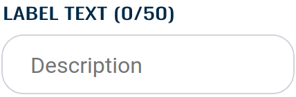

<a name="readme-top"></a>


<!-- PROJECT LOGO -->
<br />
<div align="center">
  <a href="https://github.com/ettore-infn/INFN-Design-Standards/">
    
  </a>

  <h3 align="center">INFN Design Standards</h3>

  <p align="center">
    Standard INFN design guidelines for web development.
    <br />
    <a href="https://github.com/ettore-infn/INFN-Design-Standards/"><strong>Explore the docs »</strong></a>
    <br />
    <br />
    <a href="https://github.com/ettore-infn/INFN-Design-Standards/">View Demo</a>
    ·
    <a href="https://github.com/ettore-infn/INFN-Design-Standards/issues">Report Bug</a>
    ·
    <a href="https://github.com/ettore-infn/INFN-Design-Standards/issues">Request Feature</a>
  </p>
</div>


<!-- TABLE OF CONTENTS -->
<details>
  <summary>Table of Contents</summary>
  <ol>
    <li>
      <a href="#about-the-project">About The Project</a>
    </li>
    <li>
      <a href="#getting-started">Getting Started</a>
    </li>
    <li>
      <a href="#buttons">Buttons</a>
      <ul>
        <li><a href="#regular">Regular</a></li>
        <li><a href="#outline">Outline</a></li>
        <li><a href="#no-border">No Border</a></li>
        <li><a href="#large">Large</a></li>
        <li><a href="#round">Round</a></li>
      </ul>
    </li>
    <li>
      <a href="#text">Text</a>
      <ul>
        <li><a href="#title">Title</a></li>
        <li><a href="#subtitle">Subtitle</a></li>
        <li><a href="#section-title">Section Title</a></li>
        <li><a href="#section-subtitle">Section Subtitle</a></li>
        <li><a href="#plain-text">Plain Text</a></li>
      </ul>
    </li>
    <li>
      <a href="#inputs">Inputs</a>
      <ul>
        <li><a href="#search-bar">Search Bar</a></li>
        <li><a href="#text-input">Text Input</a></li>
        <li><a href="#option-input">Option Input</a></li>
      </ul>
    </li>
    <li><a href="#contact">Contact</a></li>
    <li><a href="#acknowledgments">Acknowledgments</a></li>
  </ol>
</details>


<!-- ABOUT THE PROJECT -->
## About The Project

INFN Design standard classes repository. Use this stylesheet when creating a INFN Web App to maintain consistency through the INFN infrastructure.

<p align="right">(<a href="#readme-top">back to top</a>)</p>


<!-- GETTING STARTED -->
## Getting Started

Include the **INFN Design Standards Stylesheet** the <code>\<head\></code> of your HTML file:
```html
  <!-- INFN Design Standards Stylesheet -->
  <link rel="stylesheet" type="text/css" href="https://cdn.jsdelivr.net/gh/ettore-infn/INFN-Design-Standards@main/static/style/infn-style.css">
```
 
You can now start building your website using the INFN CSS classes!

> [!NOTE]
> Consider importing the **fontawesome** library to implement icons.

<p align="right">(<a href="#readme-top">back to top</a>)</p>


<!-- BUTTONS -->
## Buttons

There are several INFN buttons thet you can use in your project. They divides in three main categories: **primary**, **danger** and **warning**. Each of them can be viewed as a **regular button**, an **outline button**, or an **outline button with no borders**. 
You can even change the size of all buttons from **normal sized** to **large sized**.

> [!TIP]
> It's a best practice to **add an icon** to make the purpose of the button clear at a glance.


### Regular

Regular buttons are the most used, you can add them to perform regular call-to-actions and guide users towards your goal:


```html
  <div class="infn-btn infn-btn-primary">Primary</div>
  <div class="infn-btn infn-btn-danger">Danger</div>
  <div class="infn-btn infn-btn-warning">Warning</div>
```


### Outline

You can use outline buttons to perform secondary actions, when the button don't need to be a call-to-action:


```html
  <div class="infn-btn infn-btn-primary-outline">Primary</div>
  <div class="infn-btn infn-btn-danger-outline">Danger</div>
  <div class="infn-btn infn-btn-warning-outline">Warning</div>
```


### No Border

The outline buttons with no borders should be used when you don't want the button to stand out:


```html
  <div class="infn-btn infn-btn-primary-outline-no-border">Primary</div>
  <div class="infn-btn infn-btn-danger-outline-no-border">Danger</div>
  <div class="infn-btn infn-btn-warning-outline-no-border">Warning</div>
```


### Large

You can increase the size of every button adding the <code>infn-btn-lg</code> class:


```html
  <div class="infn-btn infn-btn-primary infn-btn-lg">Primary</div>
  <div class="infn-btn infn-btn-danger-outline infn-btn-lg">Danger</div>
```


### Round

Round buttons are the smaller ones and doesn't contains text. Use them when you have to minimize the occupied space, in contexts like adding a bookmark or editing a element:


```html
  <div class="infn-btn-round"><i class="fas fa-bookmark"></i></div>
```

<p align="right">(<a href="#readme-top">back to top</a>)</p>


<!-- TEXT -->
## Text

Texts within a website are the most common elements. Using them correctly can significantly increase the readability and usability of the site.


### Title

Titles are the first thing the draws the user's attention, use them wisley:


```html
  <div class="infn-title">Infn Title example</div>
```


### Subtitle

Subtitles can add extra information among the title:


```html
  <div class="infn-subtitle">Infn subtitle example</div>
```


### Section Title

Use the section titles to identify sections among the page:

> [!TIP]
> Add an icon to make the purpose of the section clear.


```html
  <div class="infn-section-title"><i class="fas fa-cloud"></i> Infn section Title example</div>
```


### Section Subtitle

Section subtitles can be used to divide the text in sub-sections or to add design details:

> [!TIP]
> Like the section title, adding an icon would help the user to identify the section faster.


```html
  <div class="infn-section-subtitle"><i class="fas fa-cloud"></i> Infn section subtitle example</div>
```


### Plain Text

Use the plain text to write all the text. You don't need to specify a class to use it:


```html
  <p>Infn text example</p>
```

<p align="right">(<a href="#readme-top">back to top</a>)</p>


<!-- INPUTS -->
## Inputs

INFN Inputs


### Search Bar

Search bars has plenty of uses, add it to filter through a list of elements or to search something inside the website:


```html
  <div class="infn-input-search-container">
      <input class="infn-input-search" type="text" placeholder="Search...">
      <i class="fas fa-search"></i>
  </div>
```


### Text Input

Mostly used in forms, the text input is the most simple input element to gain text from the user:



```html
  <div class="infn-form-group">
      <label for="description">Label Text</label>
      <input name="description" class="infn-form-group-input" type="text" placeholder="Description">
  </div>
```


### Option Input

Use the option input to make the user choose between different options:


```html
  <div class="infn-form-group">
      <label for="select">Choose a option:</label>
      <select name="select" class="infn-form-group-input">
          <option value="option1">Option 1</option>
          <option value="option2">Option 2</option>
          <option value="option3">Option 3</option>
          <option value="option4">Option 4</option>
      </select>
  </div>
```

<p align="right">(<a href="#readme-top">back to top</a>)</p>


<!-- CONTACT -->
## Contact

Your Name - [@twitter_handle](https://twitter.com/twitter_handle) - email@email_client.com

Project Link: [https://github.com/github_username/repo_name](https://github.com/github_username/repo_name)

<p align="right">(<a href="#readme-top">back to top</a>)</p>


<!-- ACKNOWLEDGMENTS -->
## Acknowledgments

* []()
* []()
* []()

<p align="right">(<a href="#readme-top">back to top</a>)</p>
